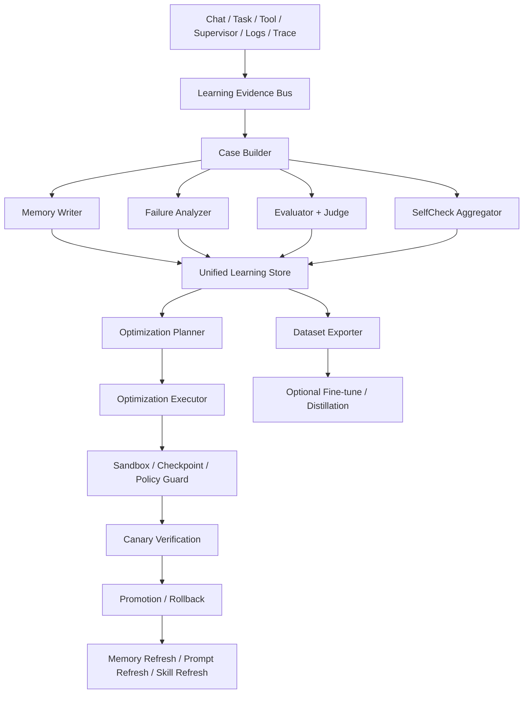

# OpenAkita 记忆与自主进化闭环方案

本文基于当前 OpenAkita 已有能力，设计一套“越用越聪明”的完整闭环方案。

这里的“越来越聪明”分 4 个层次：

1. 记忆越来越准：更少遗忘，更少脏记忆，更强检索命中
2. 决策越来越稳：更少循环、少走弯路、少重复犯错
3. 能力越来越强：缺的技能、提示、工具描述、工作流能够逐步补齐
4. 系统越来越可靠：所有自动优化都可审计、可灰度、可回滚

本文不会把“越来越聪明”错误等同于“自动训练底层大模型权重”。

在当前架构下，最现实、最安全、最可落地的路径是：

- 先做“系统层学习闭环”
- 再做“可选的数据集导出与模型微调闭环”

也就是说：

> 第一阶段让 Agent 变聪明，第二阶段才考虑让底模微调。

## 1. 现状与核心问题

当前代码里，其实已经存在 5 个半成品闭环：

- `memory`：会话沉淀、检索、每日整理
- `evaluation`：trace 评估、judge 打分、优化建议
- `self_check`：日志/复盘/记忆联合分析、有限自动修复
- `failure_analysis`：根因与 harness gap 识别
- `scheduler + policy`：后台编排、审批、防护、审计

问题不是“没有闭环”，而是“闭环彼此分散，没有统一总线和统一动作执行层”。

当前最明显的缺口有 6 个：

1. `learn_from_check()` 仍是 TODO，自检失败不会系统性回写长期记忆
2. `DailyEvaluator` 已有实现，但没有进入 scheduler 主闭环
3. `FeedbackOptimizer` 偏报告型，缺真正的执行器
4. `evaluation / self_check / failure_analysis` 没有统一证据模型
5. 自动优化没有统一的灰度、验证、推广、回滚流程
6. 系统层学习很强，但还没有可选的“训练数据导出 -> 微调”通道

## 2. 目标

这套方案的目标不是“让系统自动改一切”，而是实现一个分层闭环：

### 2.1 短周期闭环

分钟到小时级：

- 补记忆
- 识别失败模式
- 给下轮对话立即提供经验提示

### 2.2 中周期闭环

天级：

- 跑评估
- 归纳失败
- 自动生成候选优化动作
- 小范围灰度验证

### 2.3 长周期闭环

周级到月级：

- 汇总高质量成功/失败轨迹
- 生成训练集或偏好数据
- 可选导出给微调或蒸馏管道

## 3. 总体架构

新增一个统一闭环中枢：

- `LearningLoopManager`

它不替代现有模块，而是把现有模块串起来。

### 3.1 架构图



这张图的核心思想是：

- 所有学习信号先进入统一证据层
- 所有优化动作先进入统一动作层
- 所有自动变更都必须经过统一治理层

## 4. 核心设计原则

### 4.1 先学经验，再学权重

优先做：

- 记忆修正
- prompt 改善
- tool 描述修正
- skill 缺口补齐
- policy / budget / routing 调优

只有当这些上层手段收益见顶，才进入可选微调。

### 4.2 失败要结构化，不要只写日志

每个失败都要从“日志文本”升级成“可检索案例”。

### 4.3 成功案例和失败案例都要存

当前系统更偏失败导向，但要想真正越来越聪明，必须同时积累：

- 什么方法失败了
- 什么方法成功了
- 成功是因为什么成功

### 4.4 自动优化必须 fail-closed

所有自动变更必须：

- 有审批边界
- 有审计
- 有 checkpoint
- 有验证
- 有回滚

### 4.5 学习对象分层

不要把所有问题都交给 memory。

应分成 6 类学习对象：

1. 事实和偏好
2. 错误教训
3. 成功套路
4. 工具使用经验
5. 提示词与策略参数
6. 可选训练数据

## 5. 新增统一证据模型

建议新增一个统一 schema：

- `LearningCase`

它是所有闭环的公共语言。

### 5.1 `LearningCase` 建议字段

```python
class LearningCase(TypedDict):
    case_id: str
    source: str  # chat / eval / selfcheck / scheduler / manual
    session_id: str | None
    trace_id: str | None
    task_id: str | None
    workspace_id: str | None
    user_id: str | None
    created_at: str

    case_type: str  # success / failure / near_miss / regression / repair
    severity: str   # low / medium / high / critical
    domain: str     # memory / prompt / tool / skill / policy / routing

    problem_summary: str
    outcome_summary: str
    root_cause: str | None
    harness_gap: str | None
    evidence: list[str]
    metrics: dict
    replay_handles: dict

    candidate_actions: list[dict]
    verification_status: str
    lineage: dict
```

### 5.2 为什么要有这个模型

因为现在有 3 套相近但不统一的结构：

- `EvalResult`
- `CheckReport`
- `FailureAnalysisResult`

统一成 `LearningCase` 后，才能做：

- 统一记忆回写
- 统一检索
- 统一优化
- 统一审计

## 6. 统一证据总线

建议新增：

- `learning/bus.py`
- `learning/case_builder.py`
- `learning/store.py`

### 6.1 证据来源

统一接入以下信号：

1. 对话执行 trace
2. React trace
3. Supervisor 事件
4. Tool 调用结果
5. Self-check 报告
6. Evaluation 结果
7. Failure analysis 结果
8. 用户纠正
9. Approval / deny / rollback 记录
10. 记忆引用命中数据

### 6.2 证据采集触发点

建议在以下时机发事件：

- `Agent._finalize_session()` 完成后
- `ReasoningEngine` 因错误退出时
- `SelfChecker.run_daily_check()` 出报告后
- `DailyEvaluator.run_daily_eval()` 结束后
- `FailureAnalyzer.analyze_task()` 返回后
- `Policy` 发生 deny / defer / rollback 后

### 6.3 统一存储

建议新增 SQLite 表或 JSONL：

- `learning_cases`
- `learning_actions`
- `learning_verifications`
- `learning_datasets`

这样做的好处是：

- 不污染现有 `memories`
- 但又能被 memory 提炼成高价值长期知识

## 7. 记忆闭环增强

这是整个方案的第一优先级。

### 7.1 补齐 `learn_from_check()`

当前 `learn_from_check()` 还是 TODO。

建议它不直接写纯文本，而是：

1. 把失败测试转成 `LearningCase`
2. 交给 `MemoryFeedbackWriter`
3. 写入两类长期记忆

新增两类核心记忆：

- `PLAYBOOK`: 成功套路 / 推荐流程
- `ANTI_PATTERN`: 高风险失败套路 / 禁忌动作

### 7.2 当前已有记忆类型继续沿用

保留现有：

- `ERROR`
- `RULE`
- `EXPERIENCE`
- `SKILL`
- `FACT`

但把用途分清：

- `ERROR`：记“发生过什么错”
- `ANTI_PATTERN`：记“以后别这样做”
- `PLAYBOOK`：记“遇到 X 优先按这个套路做”
- `EXPERIENCE`：记“完成某类任务的经验总结”

### 7.3 记忆写回的准入条件

不是每个失败都进长期记忆。

准入条件建议：

- 同类失败在 7 天内出现 >= 2 次
- 或单次失败造成高严重度影响
- 或用户明确纠正系统
- 或评估 / 自检 / 人工审核一致认为值得沉淀

### 7.4 记忆引用反馈

新增“记忆是否帮上忙”的反馈链：

- 如果某条记忆被检索进 prompt 且本轮任务成功，提升其 `usefulness_score`
- 如果多次命中但经常导致错误方向，降低 `usefulness_score`
- 如果长期低价值，转为冷记忆或待清理

也就是说：

> 记忆不只看“被写入”，还要看“有没有产生正收益”。

## 8. 评估闭环升级

### 8.1 把 `DailyEvaluator` 接入 scheduler

建议新增系统任务：

- `system:daily_evaluation`
- `system:weekly_regression_eval`

使其和：

- `system:daily_memory`
- `system:daily_selfcheck`

并列成为标准后台任务。

### 8.2 升级 `FeedbackOptimizer`

当前 `FeedbackOptimizer` 更像报告生成器。

建议拆成两层：

- `OptimizationPlanner`：从评估结果生成候选动作
- `OptimizationExecutor`：真正执行动作

### 8.3 候选动作类型

建议标准化为 7 类：

1. `memory_write`
2. `prompt_patch`
3. `tool_hint_patch`
4. `skill_backlog_create`
5. `skill_generate`
6. `policy_tuning`
7. `routing_tuning`

### 8.4 每类动作的执行方式

- `memory_write`：通过 `MemoryManager` 正式写入，而不是只改 `MEMORY.md`
- `prompt_patch`：写入 `prompt/overrides/` 或受管片段文件
- `tool_hint_patch`：更新工具描述或使用提示
- `skill_backlog_create`：进入 backlog，等待自动生成或人工确认
- `skill_generate`：调用现有 `SkillGenerator`
- `policy_tuning`：调整少量受控参数，例如 budget / retry / compression threshold
- `routing_tuning`：优化 mode、profile、delegation 策略

## 9. 自检闭环升级

### 9.1 SelfCheck 不再只输出报告

建议输出：

- `CheckReport`
- `LearningCase[]`
- `OptimizationPlan`

### 9.2 修复策略分三级

#### A 级：自动修

范围仅限：

- `skills/`
- `tools/`
- `channels/`
- `mcps/`
- 文档型 prompt 片段

#### B 级：自动提案，待批准

范围包括：

- prompt 编排策略
- scheduler 参数
- token budget
- memory 检索参数

#### C 级：仅生成报告，禁止自动改

范围包括：

- `core/`
- `memory/`
- `llm/`
- `scheduler/`
- `agents/`

### 9.3 修复后必须回归验证

每个自动修复都必须：

1. 创建 checkpoint
2. 运行最小验证集
3. 跑相关 traces 的回放评估
4. 通过后进入 canary
5. canary 通过再推广

## 10. Failure Analysis 与 Evaluation 合并

当前 `failure_analysis` 模块价值很高，但没进入主闭环。

建议做成标准后处理步骤：

```text
任务结束
 -> 如果失败/低分/高循环/高回滚
 -> 自动调用 FailureAnalyzer
 -> 生成 LearningCase
 -> 再交给 Memory / Planner / Executor
```

### 10.1 统一根因字典

统一使用：

- `root_cause`
- `harness_gap`
- `confidence`

作为 planner 的输入。

这样就能把：

- “工具能力不足”
- “上下文丢失”
- “预算配置不合理”
- “监督缺口”

映射到具体优化动作。

## 11. 新增“成功套路”闭环

这是很多系统缺少的一环。

如果只学失败，系统会越来越保守，但不一定越来越高效。

所以建议新增：

- `SuccessPatternMiner`

### 11.1 它做什么

对高分、高完成率、低迭代、低回滚的任务，挖掘：

- 常用工具序列
- 成功的 plan 结构
- 哪类问题适合哪类 skill
- 哪类问题适合先问用户再执行

### 11.2 产出什么

产出为：

- `PLAYBOOK`
- `TOOL_CHAIN_HINT`
- `ROUTING_HINT`

### 11.3 它的价值

让系统不仅避免旧错误，还会主动复用过去的好方法。

## 12. 让“检索命中效果”反向驱动记忆质量

建议引入：

- `MemoryCreditAssigner`

它的核心任务是给记忆分 credit。

### 12.1 credit 规则

如果某轮任务中：

- 命中的记忆被引用
- 工具决策变好
- 任务成功

则提高该记忆的：

- `usefulness_score`
- `retrieval_boost`

如果：

- 某记忆多次命中但总被后续纠正
- 或经常引导出错误路线

则降低其：

- `confidence`
- `retrieval_boost`

### 12.2 结果

记忆系统会逐步从“存得多”进化到“命中准、帮得上忙”。

## 13. 加一层“学习对象注册表”

建议新增：

- `learning/registry.py`

统一声明哪些对象可被自动优化：

- memory types
- prompt fragments
- tool descriptions
- skill manifests
- scheduler knobs
- policy knobs

每个对象都声明：

- 可否自动改
- 是否需要审批
- 是否需要回归集验证
- 是否允许 canary

这能避免自动优化器“想改什么就改什么”。

## 14. 新增“优化执行器”

建议新增：

- `learning/executor.py`

它是整套方案的关键，因为当前系统最缺的就是“真正执行动作的人”。

### 14.1 执行器职责

1. 读取 `OptimizationPlan`
2. 按对象注册表检查权限
3. 按 policy 创建 checkpoint / sandbox
4. 应用变更
5. 触发验证
6. 记录结果
7. 失败则回滚

### 14.2 输出

每次执行都形成：

- `OptimizationActionRecord`

包括：

- 为什么改
- 改了什么
- 改动前后版本
- 验证结果
- 是否推广
- 是否回滚

## 15. 灰度、验证、推广、回滚

这是闭环能否安全落地的关键。

### 15.1 Shadow

先生成候选动作，但不真正生效，只做：

- 离线 replay
- 离线 eval

### 15.2 Canary

只让少量后台任务或低风险会话使用新策略。

### 15.3 Promote

当以下条件满足才推广：

- 回归集无退化
- 关键指标提升
- 审批通过
- 没有新增高危告警

### 15.4 Rollback

任何自动变更都必须支持：

- prompt 回滚
- skill 回滚
- tool hint 回滚
- 参数回滚
- checkpoint 恢复

## 16. 调度方案

建议新增 5 个系统任务：

1. `system:daily_evaluation`
2. `system:hourly_learning_ingest`
3. `system:daily_learning_review`
4. `system:weekly_promotion_review`
5. `system:monthly_dataset_export`

### 16.1 `system:hourly_learning_ingest`

做：

- 扫描新 trace
- 扫描新 self-check 报告
- 扫描新 failure analyses
- 生成 `LearningCase`
- 写入学习存储

### 16.2 `system:daily_learning_review`

做：

- 对新增案例聚类
- 挑出高频问题
- 生成候选优化动作

### 16.3 `system:weekly_promotion_review`

做：

- 汇总一周 canary 数据
- 自动决定推广、继续观察或回滚

### 16.4 `system:monthly_dataset_export`

做：

- 导出高质量成功轨迹
- 导出失败修复前后对比
- 导出偏好对齐样本

## 17. 可选的模型微调闭环

这是“系统越来越聪明”里最晚接的一环。

### 17.1 什么时候值得做

只有当下面这些都做完后，才建议上微调：

- 记忆命中率提升稳定
- prompt 和 skill 调优收益趋缓
- 高价值任务有足够多成功轨迹
- 失败标签和根因标签足够干净

### 17.2 导出哪些数据

建议导出三类：

1. `SFT`：高质量成功任务的 plan -> action -> answer 轨迹
2. `Preference`：旧答复 vs 修正后答复 / 好修复 vs 坏修复
3. `Tool-use`：正确工具调用的 JSON / 参数模式

### 17.3 微调后的接入方式

不要直接替换主模型。

建议：

- 先作为候选 compiler / routing / judge 模型
- 先跑 shadow eval
- 达标后再少量 canary

这意味着：

> 底模训练闭环必须建立在系统层闭环已经成熟的前提上。

## 18. 安全治理

### 18.1 利用现有 Policy V2

这套方案不需要绕过现有治理，反而要更依赖它。

所有自动优化动作都必须：

- 经过 `PolicyContext`
- 标记 `entry_point=evolution`
- 落 audit trail
- 走 checkpoint / sandbox / defer

### 18.2 对核心目录继续禁改

默认继续禁止自动修改：

- `src/openakita/core/`
- `src/openakita/memory/`
- `src/openakita/llm/`
- `src/openakita/agents/`
- `src/openakita/scheduler/`

对这些核心区域的改动，只允许：

- 自动生成提案
- 自动生成 patch 草案
- 人工批准后执行

### 18.3 加入预算与频率上限

自动学习任务需要：

- 日 token 预算
- 每类动作的频率上限
- 连续失败熔断
- 观察窗口

避免系统“不断自我折腾”。

## 19. 推荐的目录设计

建议新增：

```text
src/openakita/learning/
  __init__.py
  bus.py
  case_builder.py
  models.py
  store.py
  planner.py
  executor.py
  registry.py
  verifier.py
  promoter.py
  credit.py
  exporter.py
```

同时扩展现有模块：

```text
src/openakita/evolution/self_check.py         # 输出 LearningCase / OptimizationPlan
src/openakita/evaluation/optimizer.py         # 接 planner/executor
src/openakita/memory/manager.py               # 支持 usefulness / retrieval feedback
src/openakita/scheduler/executor.py           # 新增 system:daily_evaluation 等任务
src/openakita/core/policy_v2/system_tasks.py  # 真正接入部分系统维护动作
```

## 20. 分阶段落地路线

### Phase 1：打通证据闭环

目标：

- 统一 `LearningCase`
- 接入 self_check / evaluation / failure_analysis
- 补齐 `learn_from_check()`

收益：

- 从“发现问题”升级到“问题可沉淀、可追踪”

### Phase 2：打通记忆闭环

目标：

- 新增 `PLAYBOOK` / `ANTI_PATTERN`
- 引入 memory credit
- 让 retrieval 命中效果影响记忆权重

收益：

- 从“有记忆”升级到“有用的记忆越来越突出”

### Phase 3：打通优化闭环

目标：

- 引入 planner / executor / verifier
- 接入 checkpoint、policy、canary

收益：

- 从“会分析”升级到“会安全地改”

### Phase 4：打通推广闭环

目标：

- 周级 promotion review
- 灰度、回滚、指标门槛

收益：

- 从“能自动修”升级到“能稳定收敛”

### Phase 5：打通模型数据闭环

目标：

- 导出 SFT / preference / tool-use 数据
- 让模型微调成为可选项

收益：

- 从“系统层变聪明”升级到“模型层也能迭代”

## 21. 成功指标

要验证系统是否真的“越用越聪明”，必须有可量化指标。

建议跟踪：

### 21.1 对话与任务质量

- 任务完成率
- 平均迭代次数
- loop rate
- rollback rate
- 平均工具错误数
- judge score

### 21.2 记忆质量

- memory hit rate
- useful memory hit rate
- stale memory rate
- memory-caused mislead rate
- topic extraction precision

### 21.3 优化效果

- 自动优化成功率
- canary 通过率
- 回滚率
- 每类动作净收益

### 21.4 学习速度

- 同类问题重复出现次数是否下降
- 用户纠正后下一次是否避免同错
- 新技能生成后相关任务完成率是否上升

## 22. 最终效果预期

如果这套闭环打通，OpenAkita 会在 4 个层面明显变强：

### 22.1 更会记

- 重要信息更不容易丢
- 有价值的记忆更容易被召回
- 噪声记忆更容易降权和淘汰

### 22.2 更少犯同样的错

- 失败模式会沉淀成 `ANTI_PATTERN`
- 高危根因会反向约束下一轮决策

### 22.3 更会复用成功经验

- 高质量任务轨迹会沉淀成 `PLAYBOOK`
- 常见问题会逐步形成可复用套路

### 22.4 更安全地自我改进

- 自动修复不再是“一锤子 patch”
- 而是“提案 -> 执行 -> 验证 -> 灰度 -> 推广/回滚”的受控闭环

## 23. 一句话总结

这套方案的核心不是“让 AI 自己瞎改自己”，而是：

> 用统一证据总线把记忆、评估、自检、失败分析、调度和策略治理串成一条可审计、可验证、可回滚的学习闭环，让系统先在经验、提示、工具、技能和策略层面持续变聪明，再把高质量成果沉淀成可选的模型训练数据。

换句话说：

- 先让系统学会总结经验
- 再让系统学会安全地改变自己
- 最后才让模型权重成为闭环的一部分
