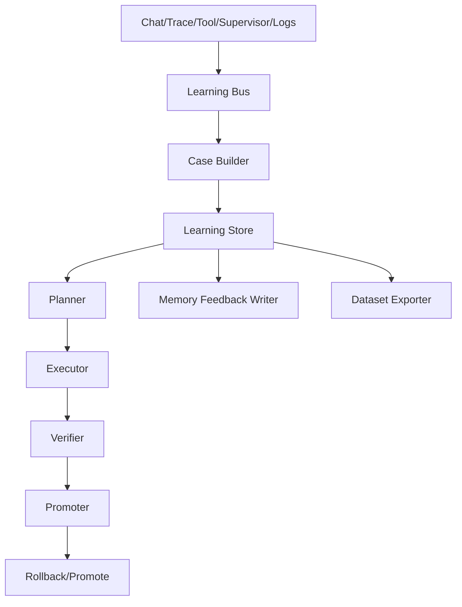

# OpenAkita 记忆与自主进化闭环实施设计说明书

本文是面向开发的详细设计文档。

目标不是再写一份“愿景方案”，而是把现有仓库中的记忆、自检、评估、调度、策略治理串成一条可落地、可分阶段实施的学习闭环，并明确：

- 先做什么
- 改哪些模块
- 新增哪些数据结构
- 暴露哪些接口
- 如何验证
- 如何灰度
- 如何回滚

## 0. 务实修订说明

本版文档基于当前代码重新收敛，遵循以下原则：

- 优先复用现有 `self_check / memory / scheduler`
- 先补齐真实缺口，再做扩展能力
- 第一阶段只增强现有记忆体系，不替换主链路
- `Scheduler` 负责自动触发与自动执行主流程，人工入口仅作为补充

因此，以下能力不作为第一阶段必做范围：

- 公开 Learning API
- setup-center 配套页面
- 完整 `promoter / dataset exporter`
- 复杂 canary / promote 基建
- 过早的 `MemoryType` 扩展

## 1. 设计目标

本次设计要补齐两类不足：

1. 记忆系统的不足
2. 自主进化闭环的不足

对应目标如下：

### 1.1 记忆目标

- 让失败经验和成功套路都能稳定沉淀
- 让“命中过的记忆是否真的帮到任务”进入反馈环
- 让记忆从“存得下”升级到“用得准”

### 1.2 自主进化目标

- 让 `evaluation / self_check / failure_analysis` 不再各自为战
- 让优化动作不再只是“写报告”，而是受控执行
- 让自动优化具备验证、灰度、推广、回滚能力
- 让 `Scheduler` 成为自进化闭环的主入口、主触发器与主执行器
- 在无人值守场景下，系统也能按计划自动完成完整闭环

### 1.3 边界

本设计**不**包含：

- 自动训练基础模型权重
- 自动修改 `core/ memory/ llm/ agents/ scheduler` 核心代码并直接生效
- 无约束的“自我改写”

本设计**包含**：

- 系统层学习闭环
- 受控的外层优化闭环
- 可选的训练数据导出闭环
- 基于 `Scheduler` 的全自动触发与全自动执行机制
- 与现有 `/selfcheck`、现有自检入口、现有记忆整理入口保持兼容

## 2. 当前代码中的真实缺口

### 2.1 记忆侧缺口

- `SelfChecker.learn_from_check()` 仍是 TODO，失败测试不会正式进入长期记忆
- 当前记忆沉淀偏重对话抽取，缺“后验复盘案例”写回链
- 记忆检索有命中机制，但没有“收益归因”机制

### 2.2 进化侧缺口

- `DailyEvaluator` 已实现但未接入 scheduler 主流程
- `FeedbackOptimizer` 主要写 `MEMORY.md` 和 JSON 报告，没有真正的执行器
- `FailureAnalyzer` 有价值，但未进入统一闭环
- 自动优化缺少统一验证与 canary 推广机制

### 2.3 治理侧缺口

- `system_tasks.py` 基础设施存在，但未挂生产调用
- 自动修复的范围限制合理，但与“候选动作 -> 验证 -> 推广”没有统一协议

## 3. 设计总览

本次实施新增一个上层模块：

- `src/openakita/learning/`

它不替代现有模块，而是作为：

- 统一证据层
- 后续可扩展的计划层
- 后续可扩展的执行层
- 后续可扩展的验证层

### 3.1 高层架构



说明：

- 上图描述的是长期目标架构
- 第一阶段不要求一次性实现 `Planner / Executor / Verifier / Promoter / Dataset Exporter`
- 第一阶段重点是 `LearningCase -> Store -> MemoryFeedbackWriter -> Scheduler Review`

### 3.2 核心闭环

```text
执行任务
 -> 采集证据
 -> 归一成 LearningCase
 -> 写入 learning store
 -> review 判断是否写回长期记忆
 -> 结果再次回写为新的 LearningCase 和长期记忆
```

第三阶段再扩展为：

```text
LearningCase
 -> planner 生成低风险候选动作
 -> executor 在 policy/checkpoint/sandbox 下执行
 -> verifier 做最小验证
 -> 成功后继续沉淀为新的 LearningCase
```

### 3.3 触发总原则

本方案明确采用：

- **Scheduler First**

即：

- `Scheduler` 是学习闭环的默认入口
- `Scheduler` 是学习闭环的定时触发中心
- `Scheduler` 是学习闭环的后台执行中心
- `Scheduler` 是学习闭环的推进与恢复中心

人工入口不是主入口，而是：

- 一个补充入口
- 一个调试入口
- 一个强制触发入口
- 一个人工观测入口

换句话说：

> 正常运行时，系统应当在无人值守条件下，依靠 `Scheduler` 完成记忆沉淀、案例归档、候选动作生成、自动执行、验证、推广或回滚。

对第一阶段而言，这句话可具体化为：

> 系统应当在无人值守条件下，依靠 `Scheduler` 完成案例归档、长期记忆回写和日常 review。

## 3.4 入口兼容原则

本设计要求保持现有入口不变：

- 现有 `system:daily_memory`
- 现有 `system:daily_selfcheck`
- 现有 `system:memory_nudge_review`
- 现有 `/selfcheck`

在此基础上，只新增：

- learning 相关的 scheduler 系统任务
- learning 相关的人工触发入口

因此：

- 不替换原入口
- 不破坏原入口
- 原入口仍可继续用
- 但默认主路径迁移到 Scheduler 的定时自动执行

## 4. 模块设计

建议新增目录：

```text
src/openakita/learning/
  __init__.py
  models.py
  store.py
  case_builder.py
  feedback_writer.py
  scheduler_hooks.py
```

### 4.1 `models.py`

定义第一阶段必需的数据结构：

- `LearningCase`

后续扩展结构：

- `OptimizationAction`
- `VerificationRun`
- `MemoryCredit`

### 4.2 `case_builder.py`

将多种来源转成统一 `LearningCase`。

输入来源：

- `CheckReport`
- `FailureAnalysisResult`
- 用户显式纠正
- 会话失败收尾信息

第一阶段不引入独立 event bus，避免过度设计。

### 4.3 `store.py`

负责持久化最小必要数据：

- `learning_cases`

可选增加：

- `learning_runs`，记录 scheduler 批次执行结果

### 4.4 `feedback_writer.py`

这是第一阶段的关键模块。

职责：

- 把 `LearningCase` 转成现有记忆系统可接受的写入请求
- 通过现有 `MemoryManager` 写入 `ERROR / EXPERIENCE`
- 控制写入阈值，避免污染长期记忆

### 4.5 `scheduler_hooks.py`

负责把 learning 闭环接到现有 scheduler：

- 注册 learning 相关系统任务
- 触发 ingest / review
- 记录执行结果

### 4.6 第二阶段及以后再扩展

以下模块全部后置，不属于当前必须交付：

- `planner.py`
- `executor.py`
- `verifier.py`
- `promoter.py`
- `credit.py`
- `exporter.py`
- `feature_flags.py`

## 5. 数据模型设计

## 5.1 `LearningCase`

建议定义如下：

```python
@dataclass
class LearningCase:
    case_id: str
    source: str
    case_type: str
    severity: str
    domain: str

    session_id: str | None = None
    conversation_id: str | None = None
    trace_id: str | None = None
    task_id: str | None = None
    workspace_id: str | None = None
    user_id: str | None = None

    created_at: str = ""
    problem_summary: str = ""
    outcome_summary: str = ""
    root_cause: str | None = None
    harness_gap: str | None = None

    evidence: list[str] = field(default_factory=list)
    metrics: dict[str, Any] = field(default_factory=dict)
    tags: list[str] = field(default_factory=list)
    replay_handles: dict[str, Any] = field(default_factory=dict)
    candidate_actions: list[dict[str, Any]] = field(default_factory=list)
    lineage: dict[str, Any] = field(default_factory=dict)
```

### 5.1.1 `case_type`

枚举建议：

- `success`
- `failure`
- `near_miss`
- `regression`
- `repair`
- `user_correction`

### 5.1.2 `domain`

枚举建议：

- `memory`
- `prompt`
- `tool`
- `skill`
- `policy`
- `routing`
- `scheduler`

## 5.2 第二阶段扩展数据结构

以下数据结构保留为后续扩展：

- `OptimizationAction`
- `VerificationRun`
- `MemoryCredit`

### 5.2.1 `OptimizationAction`

```python
@dataclass
class OptimizationAction:
    action_id: str
    case_id: str
    action_type: str
    target_kind: str
    target_ref: str
    description: str
    payload: dict[str, Any]
    risk_level: str
    requires_approval: bool
    status: str
```

### 5.2.2 `target_kind`

- `memory_type`
- `prompt_fragment`
- `tool_hint`
- `skill`
- `policy_knob`
- `routing_rule`

## 5.3 `MemoryCredit`

```python
@dataclass
class MemoryCredit:
    memory_id: str
    hit_count: int = 0
    helpful_count: int = 0
    harmful_count: int = 0
    neutral_count: int = 0
    last_hit_at: str | None = None
    usefulness_score: float = 0.0
    retrieval_boost: float = 0.0
```

## 6. 持久化设计

建议沿用 SQLite，为 `data/learning/openakita_learning.db` 单独建库。

### 6.1 第一阶段表设计

#### `learning_cases`

- `case_id TEXT PRIMARY KEY`
- `source TEXT`
- `case_type TEXT`
- `severity TEXT`
- `domain TEXT`
- `session_id TEXT`
- `conversation_id TEXT`
- `trace_id TEXT`
- `task_id TEXT`
- `workspace_id TEXT`
- `user_id TEXT`
- `problem_summary TEXT`
- `outcome_summary TEXT`
- `root_cause TEXT`
- `harness_gap TEXT`
- `metrics_json TEXT`
- `evidence_json TEXT`
- `tags_json TEXT`
- `candidate_actions_json TEXT`
- `lineage_json TEXT`
- `created_at TEXT`

索引：

- `(created_at)`
- `(domain, case_type, created_at)`
- `(workspace_id, created_at)`
- `(trace_id)`

第一阶段可选增加：

#### `learning_runs`

- `run_id TEXT PRIMARY KEY`
- `trigger_source TEXT`
- `started_at TEXT`
- `finished_at TEXT`
- `status TEXT`
- `summary_json TEXT`

以下表全部后置到第二阶段或第三阶段：

- `learning_actions`
- `learning_verifications`
- `learning_promotions`
- `memory_credit`

## 7. 与现有模块的接入点

## 7.1 `evolution/self_check.py`

### 当前问题

- `learn_from_check()` 只有日志，没有落库存储和长期沉淀

### 改造要求

新增流程：

```text
learn_from_check(report)
 -> failures 转成 LearningCase
 -> 写 learning_cases
 -> 调用 MemoryFeedbackWriter 生成 ERROR / EXPERIENCE
```

### 需要新增的方法

- `_build_cases_from_check(report)`
- `_write_check_cases(cases)`
- `_generate_check_memory_feedback(cases)`

## 7.2 `evaluation/optimizer.py`

### 当前问题

- `FeedbackOptimizer` 只写 `MEMORY.md` 和 JSON 文件

### 改造要求

第一阶段不要求重构为完整 planner / executor。

务实改造方式：

- `FeedbackAnalyzer` 保留
- `FeedbackOptimizer` 暂时保留兼容层
- 新增 `to_learning_case()` 适配逻辑
- 先让评估结果能进入 `learning_cases`

### 新流程

```text
DailyEvaluator.run_daily_eval()
 -> EvalRunner 产出结果
 -> analyzer 产出结果摘要
 -> case_builder 产出 LearningCase
 -> 写 learning_cases
 -> review 阶段决定是否写回长期记忆或进入低风险候选动作
```

## 7.3 `evolution/failure_analysis.py`

### 改造要求

将 `FailureAnalysisResult` 标准接入 `LearningCase`。

新增适配方法：

- `to_learning_case()`

并在任务失败收尾路径里调用。

## 7.4 `memory/manager.py`

### 改造要求

第一阶段不新增 `MemoryType`，避免扩大现有记忆体系改动面。

第一阶段改造方式：

- 失败经验写入现有 `ERROR`
- 成功套路写入现有 `EXPERIENCE`
- 通过 `tags` 或 `metadata` 区分 `playbook / anti_pattern`

第一阶段也不改检索排序。

也就是说，以下能力后置：

- `record_memory_hit(...)`
- `record_memory_outcome(...)`
- `recompute_retrieval_boost(...)`
- 基于 `retrieval_boost` 的 rerank

## 7.5 `scheduler/executor.py`

### 改造要求

新增系统任务：

- `system:hourly_learning_ingest`
- `system:daily_learning_review`

后续扩展任务：

- `system:daily_evaluation`
- `system:weekly_promotion_review`
- `system:monthly_dataset_export`

### 建议调度语义

- `hourly_learning_ingest`: 每小时
- `daily_learning_review`: 每日清晨

后续扩展：

- `daily_evaluation`: 每日凌晨
- `weekly_promotion_review`: 每周
- `monthly_dataset_export`: 每月

## 7.6 `policy_v2`

### 改造要求

新增学习动作上下文标签：

- `entry_point=learning`
- `learning_action_id`
- `learning_plan_id`

要求自动优化一律：

- 能创建 checkpoint
- 能输出 audit
- 能被回滚

这些要求主要用于第三阶段低风险自动优化。

第一阶段只要求：

- learning 相关系统任务具备清晰日志
- learning 写回具备来源标记
- 写回失败不会影响现有记忆主流程

## 8. 关键子系统设计

## 8.1 Memory Feedback Writer

这是第一批必须实现的组件。

职责：

- 把 `LearningCase` 转成长期记忆
- 过滤低质量、一次性、噪声案例
- 区分 `ERROR / EXPERIENCE`
- 在 `tags/metadata` 中标记 `playbook / anti_pattern`

### 8.1.1 写入规则

- 高频失败 -> `ERROR` + `anti_pattern` tag
- 成功套路 -> `EXPERIENCE` + `playbook` tag
- 用户显式纠正 -> `RULE` 或 `PREFERENCE`
- 具体事故总结 -> `ERROR`
- 可复用做法 -> `EXPERIENCE`

### 8.1.2 准入阈值

- 最近 7 天重复 >= 2 次
- 或严重度 >= `high`
- 或人工确认
- 或来自评估回归集的高置信结论

## 8.2 第二阶段：Memory Credit Assigner

职责：

- 记录哪些记忆被检索了
- 记录它们对本次任务是否有帮助
- 调整后续排序权重

### 8.2.1 归因规则

如果满足以下条件之一，则记为 helpful：

- 记忆命中后对应任务成功完成
- 任务迭代数下降
- 相同问题重复失败次数下降

如果满足以下条件之一，则记为 harmful：

- 命中后用户立即纠正
- 命中后走向明显错误分支
- 命中后回滚/失败/重试率上升

该模块不纳入第一阶段交付。

## 8.3 第三阶段：Optimization Planner

输入：

- `LearningCase[]`

输出：

- `OptimizationPlan`

### 8.3.1 规划规则示例

- `root_cause=TOOL_LIMITATION` -> `tool_hint_patch` / `skill_backlog_create`
- `harness_gap=POOR_CONTEXT_ENGINEERING` -> `prompt_patch`
- `root_cause=BUDGET_EXHAUSTION` -> `policy_tuning`
- `frequent judge suggestions` -> `skill_generate`

### 8.3.2 规划约束

- 单日每类动作上限
- 同一 target 变更冷却窗口
- 高风险动作必须进入自动沙箱、自动验证与自动回滚链
- 人工审批不是默认前置条件，而是可选覆盖策略

## 8.4 第三阶段：Optimization Executor

### 8.4.1 允许自动执行的目标

第三阶段只允许：

- `prompt/overrides/`
- `data/evaluation/`
- `skills/`
- 工具提示词片段
- 少量受控参数

这些目标要求在 Scheduler 场景下可无人值守自动完成：

- 自动生成变更
- 自动应用变更
- 自动验证
- 自动进入 shadow / canary / promote / rollback

默认不要求人工确认。

### 8.4.2 禁止直接自动执行的目标

- `src/openakita/core/`
- `src/openakita/memory/`
- `src/openakita/llm/`
- `src/openakita/agents/`
- `src/openakita/scheduler/`

对这些只生成：

- 提案
- patch 草案
- 审核请求

注意：

- 这不表示学习闭环中断
- 而是表示该类目标不在“全自动可执行范围”内
- Scheduler 仍需完整完成案例归档、原因分析、提案生成、验证建议和审计落盘

## 8.5 第三阶段：Verifier

### 8.5.1 验证级别

#### `smoke`

- 配置可加载
- 技能可解析
- prompt 片段可编译

#### `replay`

- 对指定 trace 做局部回放

#### `eval_subset`

- 对相关样本子集跑评估

#### `canary`

- 在少量后台任务或少量 session 中启用

### 8.5.2 通过门槛

- 完成率不下降
- loop rate 不上升
- 严重错误不增加
- judge score 提升或持平

## 8.6 后续扩展：Promoter

职责：

- 汇总 canary 指标
- 做推广或回滚决策

决策枚举：

- `hold`
- `promote`
- `rollback`
- `manual_review`

默认决策顺序为：

```text
shadow -> canary -> promote / rollback
```

其中：

- `manual_review` 是补充模式
- 不是默认必经步骤
- 只有在系统显式配置或超出自动执行范围时才进入

## 9. API 与运维接口

第一阶段不新增公开 API。

原因：

- learning 闭环还在收敛期
- 当前更适合通过 scheduler、日志、报告文件和 SQLite 观察
- 过早公开接口会扩大维护面

第一阶段保留并复用现有入口：

- CLI `/selfcheck`
- 现有记忆整理入口
- 现有调度任务入口

如确有需要，第二阶段再补最小人工触发入口：

- `POST /api/learning/run-ingest`
- `POST /api/learning/run-review`

以下 API 全部后置：

- Learning Cases 查询 API
- Actions API
- Verification API
- Dataset Export API

## 10. 配置设计

建议新增最小配置项：

```env
LEARNING_LOOP_ENABLED=true
LEARNING_INGEST_ENABLED=true
LEARNING_MANUAL_TRIGGER_ENABLED=true
LEARNING_SCHEDULER_PRIMARY=true
LEARNING_CASE_RETENTION_DAYS=180
LEARNING_MIN_REPEAT_FOR_MEMORY_WRITE=2
LEARNING_ENABLE_LOW_RISK_AUTOFIX=false
```

以下配置保留到后续阶段：

- `LEARNING_CANARY_*`
- `LEARNING_DATASET_EXPORT_*`
- `LEARNING_MEMORY_CREDIT_*`
- 动作级配额与高风险动作限制

## 11. 迁移策略

## 11.1 Phase 1：打通最小自动闭环

实施内容：

- 新增 `learning/models.py`
- 新增 `learning/store.py`
- 新增 `learning/case_builder.py`
- 新增 `learning/feedback_writer.py`
- `self_check.learn_from_check()` 输出 `LearningCase`
- `failure_analysis` 输出 `LearningCase`
- 保持原有 `/selfcheck` 与 scheduler 入口兼容
- 新增 `system:hourly_learning_ingest`
- 新增 `system:daily_learning_review`
- 通过现有 `MemoryManager` 回写 `ERROR / EXPERIENCE`

交付结果：

- 能看到统一案例库
- 能从自检失败生成结构化案例
- 能按 Scheduler 周期自动把高价值案例写回长期记忆

## 11.2 Phase 2：增强记忆反馈与评估接入

实施内容：

- 让 `DailyEvaluator` 正式接入 scheduler
- 评估结果也进入 `LearningCase`
- 增加最小记忆命中统计

交付结果：

- 自检和评估失败能回写长期记忆
- 成功套路能写入长期经验

## 11.3 Phase 3：低风险自动优化

实施内容：

- 新增最小 `planner / executor / verifier`
- 只允许 prompt 片段、技能提示、少量受控参数自动调整
- 继续以 Scheduler 作为学习闭环默认主入口

交付结果：

- 低风险动作可以由 Scheduler 自动执行并自动验证

## 11.4 后续扩展

后续再考虑：

- `promoter`
- `dataset exporter`
- 公开 API
- setup-center 页面
- 更复杂的 canary / promote 流程

## 12. 开发任务拆分

建议按下面顺序开发。

### 12.1 第一批任务

1. 新增 `learning/models.py`
2. 新增 `learning/store.py`
3. 新增 `learning/case_builder.py`
4. 新增 `learning/feedback_writer.py`
5. 在 `self_check.learn_from_check()` 写入 `LearningCase`
6. 给 `failure_analysis.py` 增加 `to_learning_case()`
7. 在 scheduler 中新增 `system:hourly_learning_ingest`
8. 在 scheduler 中新增 `system:daily_learning_review`

### 12.2 第二批任务

1. 将 `DailyEvaluator` 接入 scheduler
2. 在 `evaluation/optimizer.py` 增加 `LearningCase` 适配器
3. 增加最小记忆命中统计

### 12.3 第三批任务

1. 新增 `planner.py`
2. 新增 `executor.py`
3. 新增 `verifier.py`
4. 接入 Policy 和 checkpoint

### 12.4 第四批任务

1. 新增 `promoter.py`
2. 新增 `exporter.py`
3. 补 API 路由和 setup-center 页面
4. 增加手动补跑入口，但保持其为补充入口

## 13. 测试策略

## 13.1 单元测试

需要新增：

- `test_learning_case_builder.py`
- `test_learning_store.py`
- `test_memory_feedback_writer.py`

以下测试后置：

- `test_memory_credit_assigner.py`
- `test_learning_planner.py`
- `test_learning_verifier.py`

## 13.2 集成测试

需要覆盖：

- 自检失败 -> LearningCase -> Memory 写回
- scheduler 定时触发 ingest / review

以下集成测试后置：

- Eval 结果 -> Planner -> Action 生成
- Action -> Verifier -> Promote/Rollback
- Memory hit -> outcome -> credit 更新

## 13.3 回归测试

第一阶段只要求：

- 高频失败案例集
- 高频成功案例集

风险动作案例集后置到第三阶段。

## 14. 验收标准

以下条件满足，视为第一版闭环落地成功。

### 14.1 必要条件

- 自检失败可以落到 `learning_cases`
- 自检失败可以生成长期错误经验
- learning 闭环可在无人值守场景下由 Scheduler 自动完成主流程
- 现有入口仍可继续触发同一套闭环逻辑

### 14.2 质量条件

- 人工不介入时，自动链路仍能完成 ingest -> case write -> memory feedback -> review
- 误写入长期记忆的比例可控

第三阶段再补：

- 至少支持 2 种自动执行动作
- 至少支持 2 种验证模式
- 所有自动动作都有 action record 和 rollback record

### 14.3 指标条件

- 同类失败重复率下降
- 关键任务完成率提升或不下降

后续扩展指标：

- loop rate 不显著上升
- 有用记忆命中率提升

## 15. 风险与应对

### 15.1 风险：系统过度自我折腾

应对：

- 日上限
- 冷却窗口
- canary
- 自动验证
- 自动回滚
- 人工审批仅作为可选保险丝

### 15.1.1 无人值守要求

因为本方案要求支持 Scheduler 无人值守自动完成，所以风险控制必须从“人工审批前置”改为“系统内建防护前置”：

- 预算控制
- 可执行范围限制
- checkpoint
- sandbox
- shadow/canary
- 自动回滚
- 熔断

### 15.2 风险：错误经验污染长期记忆

应对：

- 准入阈值
- 二次确认
- usefulness/ harmful 反馈

### 15.3 风险：自动 patch 破坏系统

应对：

- 严格限制自动修改范围
- checkpoint + rollback
- shadow -> canary -> promote

### 15.4 风险：评估数据噪声太大

应对：

- 先从高频任务与高置信失败开始
- 优先聚类后再生成动作

## 16. 最终建议

从落地角度看，最优先的不是“一次性做完所有模块”，而是按下面顺序推进：

1. 统一案例库
2. 自检失败回写记忆
3. Scheduler 主入口化
4. 评估接入调度
5. 低风险自动优化
6. 再考虑灰度推广和数据集导出

## 17. 一句话总结

这份实施设计的核心，是把 OpenAkita 现有的记忆、自检、评估、失败分析、调度和策略治理，组织成一条：

> 可采集、可沉淀、可执行、可验证、可灰度、可回滚的系统层学习闭环

先让系统在经验、提示、工具、技能、策略层面持续变聪明，再把稳定产物导出为模型训练数据。
