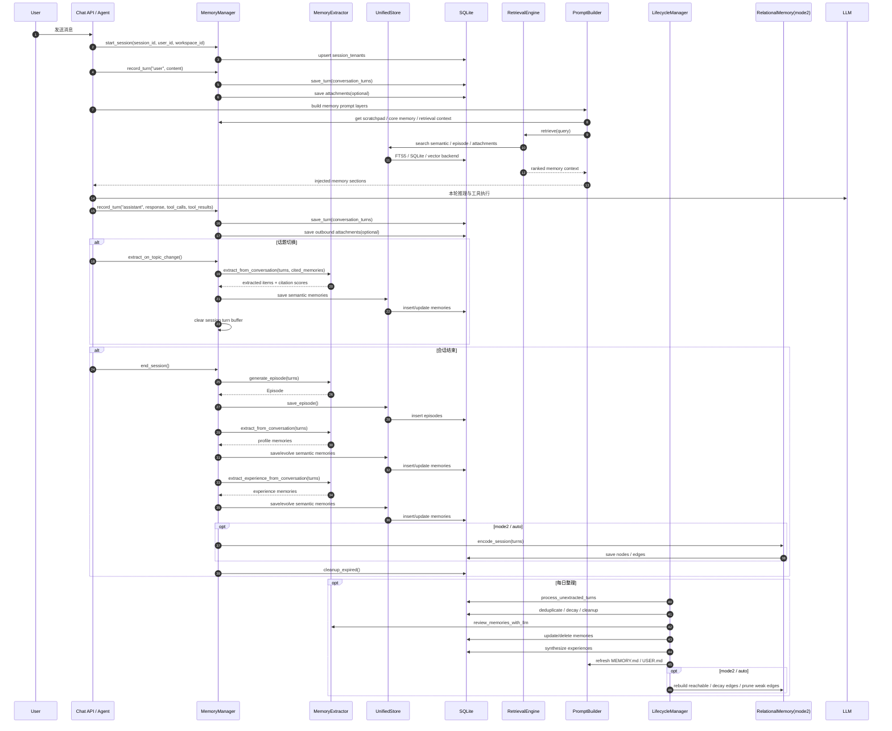

# OpenAkita 记忆系统时序图

本文把 OpenAkita 记忆系统的主链路按时序整理出来。

它回答的问题是：

- 一条用户消息进入后，记忆系统什么时候介入
- 哪些数据是即时写入，哪些是后台抽取
- Session、Memory、Prompt 注入之间如何协作
- topic change、session end、daily consolidation 分别做什么
- mode1 / mode2 在时序上分别出现在什么阶段

## 1. 总览

OpenAkita 的记忆系统不是单点调用，而是贯穿整轮对话生命周期的。

从时序上看，主要有 5 条链：

1. 会话开始链：对齐 session/user/workspace 记忆上下文
2. 实时写入链：把 turn、附件、引用记录进数据库
3. 抽取沉淀链：从对话提炼长期记忆和经验
4. 检索注入链：从长期记忆里召回并注入 prompt
5. 每日整理链：去重、衰减、审查、合成、刷新身份文件

## 2. 主时序图



## 3. 阶段 1：会话开始

### 3.1 记忆 session 对齐

当 Agent 进入 `_prepare_session_context()` 时，会先把当前对话线程对齐到 `MemoryManager`：

- 确定 `session_id`
- 确定 `user_id`
- 确定 `workspace_id`
- 将 `(session_id -> user_id/workspace_id)` 写入 `session_tenants`
- 初始化本轮 session turn buffer
- 绑定当前检索作用域

这一步的目的不是存消息，而是建立“这轮对话属于谁、属于哪个工作区”的记忆边界。

### 3.2 为什么要先做 workspace 解析

因为 OpenAkita 不希望所有项目共用一锅长期记忆。

所以在 desktop/api/cli/web 这类通道中，会根据配置选择：

- 继续用 legacy 的 `default` 工作区
- 或把当前项目目录哈希成一个稳定的 `workspace_id`

这一步决定了：

- 后面写入哪一份长期记忆
- 检索时能看到哪一份长期记忆

## 4. 阶段 2：实时写入

### 4.1 `record_turn()` 做了什么

每一轮用户消息和 assistant 回复，都会调用 `record_turn()`：

- 追加到内存中的 `_session_turns`
- 更新 `_recent_messages`
- 写入 SQLite `conversation_turns`
- 兼容写 JSONL
- 如果本轮有附件，则把附件写入 `attachments`

注意：

- 这里写入的是“原始对话事实”
- 还不是长期记忆 `memories`

### 4.2 为什么要先写 turn，不直接写长期记忆

因为大部分对话不值得进入长期记忆。

OpenAkita 的策略是：

- 先保留完整 turn 证据
- 后续在话题切换或会话结束时再做抽取

这样可以避免把一次性任务请求、临时参数、流水账大量写成长期记忆。

## 5. 阶段 3：检索注入

在本轮真正推理前，PromptBuilder 会从记忆系统取 5 层内容：

1. Memory system guide
2. Scratchpad
3. Pinned rules
4. Core memory (`MEMORY.md`)
5. Experience hints / active retrieval / relational retrieval

这意味着记忆不是“对话结束后才有用”，而是在每轮开始时就会反向影响推理。

### 5.1 检索链

`RetrievalEngine.retrieve()` 的多路召回顺序大致是：

- semantic memories
- episodes
- recent results
- attachments
- optional external retrieval sources

然后统一：

- merge
- deduplicate
- rerank
- budget trim

### 5.2 什么情况下不检索

OpenAkita 对短闲聊会做保护：

- 短消息
- 没有明确 memory keywords
- 明显只是“继续”“嗯”“ok”这类轻交互

这种情况下会跳过重检索，减少时延和噪声。

## 6. 阶段 4：话题切换抽取

### 6.1 为什么 topic change 很重要

对于长会话，如果一直等到 session end 才抽取，代价会太高，而且话题会混在一起。

所以当 Agent 识别到话题明显切换时，会触发：

- `extract_on_topic_change()`

### 6.2 它的处理步骤

1. 复制当前 `_session_turns`
2. 取出这一阶段被引用过的 memories
3. 调 `MemoryExtractor.extract_from_conversation()`
4. 应用 citation scores，给有用的旧记忆增加访问权重
5. 将新抽取项保存到长期记忆
6. 清空当前话题的 turn buffer

### 6.3 这一步的意义

它相当于：

- 把一段话题从短期工作记忆压成长期知识
- 给“真正帮上忙的旧记忆”加权
- 让下一个话题从相对干净的 turn 缓冲开始

## 7. 阶段 5：会话结束沉淀

`end_session()` 是记忆系统最重的一次沉淀点。

### 7.1 情节记忆

先生成 `Episode`：

- 总结本次 session 做了什么
- 用户目标是什么
- 最终结果如何
- 用了哪些工具
- 涉及哪些实体

这类记忆不是细节事实，而是“完整故事”。

### 7.2 用户画像提取

接着从整段对话提取：

- FACT
- PREFERENCE
- RULE
- SKILL
- ERROR
- PERSONA_TRAIT
- EXPERIENCE

抽取结果会经过：

- 优先级判断
- subject/predicate 精确去重
- 相似内容检索
- 必要时 LLM 去重确认

### 7.3 经验提取

除了“用户是谁”，还会单独提取“任务经验”。

这意味着系统有意识地区分：

- 用户身份 / 偏好 / 规则
- 完成任务的方法 / 教训 /经验

### 7.4 mode2 编码

如果记忆模式是 `mode2` 或 `auto`，session end 还会触发关系图编码：

- turn -> nodes
- nodes -> edges

这是 mode2 和 mode1 最大的时序差异之一：

- mode1 到这里基本完成语义记忆沉淀
- mode2 还会继续把会话转成图结构

## 8. 阶段 6：每日整理

`consolidate_daily()` 是后台记忆维护链。

### 8.1 顺序

标准顺序是：

1. `process_unextracted_turns()`
2. `deduplicate_batch()`
3. `compute_decay()`
4. `cleanup_stale_attachments()`
5. `review_memories_with_llm()`
6. `synthesize_experiences()`
7. `refresh_memory_md()`
8. `refresh_user_md()`
9. sync vector store
10. relational consolidation（mode2）

### 8.2 它不是简单清理

这条链实际上在做 4 件事：

- 把漏掉的 turn 补抽取
- 给旧记忆降权 / 过期
- 用 LLM 复核哪些记忆该保留、合并、删除
- 把高价值记忆重新汇总成身份文件

## 9. 三种数据在时序中的位置

### 9.1 `conversation_turns`

定位：

- 原始证据层

特点：

- 写得早
- 粒度细
- 先保存事实，再决定是否升格为长期记忆

### 9.2 `memories`

定位：

- 长期语义知识层

特点：

- 抽取后才进入
- 有优先级
- 有作用域
- 有 TTL / decay / dedup / review

### 9.3 `episodes`

定位：

- 历史情节层

特点：

- 对整段 session 做高层摘要
- 适合“之前发生过什么”的检索

## 10. mode1 和 mode2 在时序上的差异

### mode1

主链路是：

```text
turn -> extract semantic memories -> retrieve -> inject
```

它更像：

- 结构化事实仓库
- 偏好/规则/经验条目库

### mode2

在 mode1 基础上，还多了一条：

```text
turn/session -> graph encoding -> nodes/edges -> graph traversal retrieval
```

它更像：

- 会话事件图
- 因果/时间/实体/动作关系图

## 11. 一个典型例子

用户说：

```text
昨天你帮我排查了 Docker 端口冲突，最后是因为 compose 文件里映射重复。
现在我想知道同一个项目里之前类似问题还有哪些。
```

### mode1 的处理倾向

- 提取“Docker 端口冲突”“compose 文件映射重复”这类事实和经验
- 检索相似语义条目
- 返回若干相关事实/经验片段

### mode2 的处理倾向

- 把“昨天”“项目”“端口冲突”“映射重复”“排查动作”“结果”编码成节点和边
- 检索时可沿着 temporal / causal / entity 维度找“同项目”“类似事件”“导致结果”的路径
- 更适合回答“之前发生过哪些同类问题、原因链是什么”

## 12. 时序图背后的设计哲学

从时序上看，OpenAkita 的记忆设计非常明确：

- 聊天时不要被记忆拖慢主链路
- 先存证据，再异步抽取长期知识
- 检索时优先给模型高价值摘要，而不是塞原始历史
- 维护不是一次性动作，而是持续后台整理
- mode2 不替代 mode1，而是叠加一层图结构能力

## 13. 阅读顺序建议

如果你要沿着时序继续读代码，推荐顺序：

1. `src/openakita/memory/manager.py`
2. `src/openakita/memory/extractor.py`
3. `src/openakita/memory/retrieval.py`
4. `src/openakita/memory/storage.py`
5. `src/openakita/prompt/builder.py`
6. `src/openakita/memory/lifecycle.py`
7. `src/openakita/memory/relational/encoder.py`
8. `src/openakita/memory/relational/store.py`
9. `src/openakita/memory/relational/graph_engine.py`

## 14. 一句话总结

OpenAkita 的记忆系统时序不是：

```text
聊天结束 -> 存一下
```

而是：

```text
会话开始对齐 -> 每轮实时记证据 -> 推理前主动检索注入 ->
话题切换抽取 -> 会话结束沉淀 -> 每日后台整理 -> 下轮再次被检索利用
```

这说明它本质上是一个持续运转的记忆循环系统，而不是聊天记录附属品。
